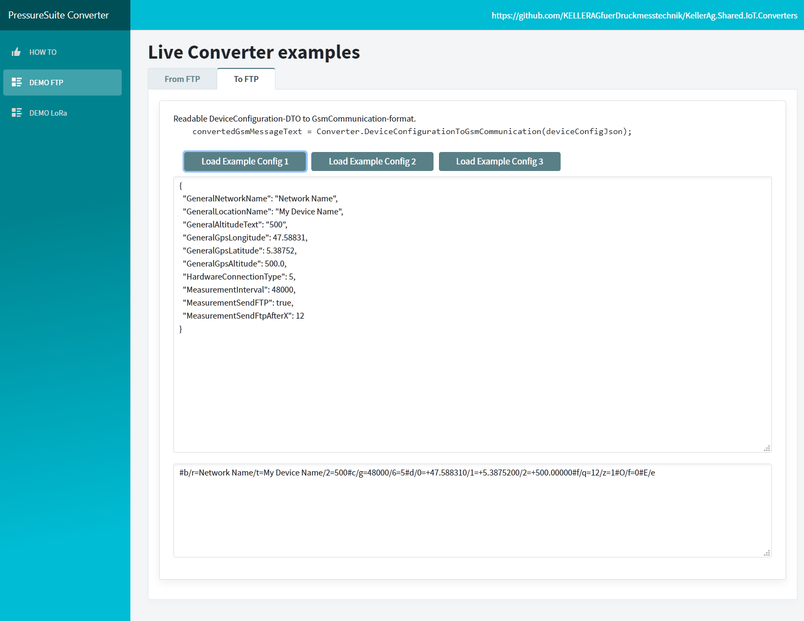
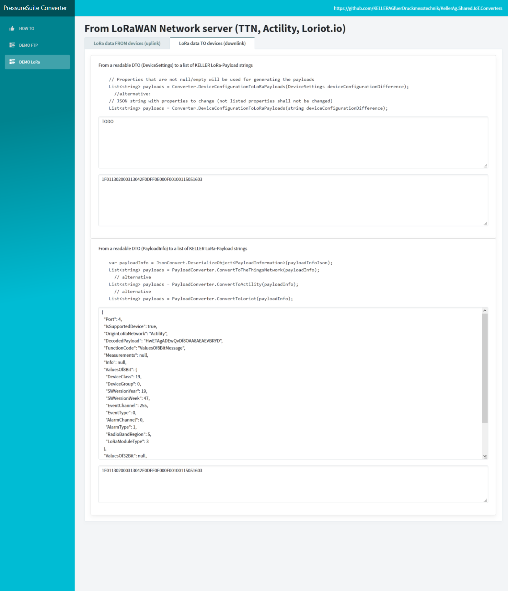

# KellerAg.Shared.IoT.Converters and Live-Editor


The *KellerAg.Shared.IoT.Converters* are a set of **.NET** DLLs to handle proprietary communication data from [IoT devices](https://keller-pressure.com/en/products/wireless-solutions) of the company [KELLER Pressure](https://keller-pressure.com).  
If you rather prefer to use **Python** then please have a look at https://github.com/KELLERAGfuerDruckmesstechnik/KellerAg.Shared.IoT.Converters/releases/tag/Tool  


The main purpose is to demonstrate one possible way to implement the text data stored on FTP folders (via 2G/3G/4G/NB-IoT/LTE-M) or JSON text from/to LoRaWAN network server (TheThingsNetwork / ThingsPark (Actility) / Loriot.io).  

The communication protocols are public:  
- [Communication protocol ADT1 LoRaWAN](https://keller-pressure.com/en/downloads?id=i95uBmiSyeNVqggKhodRsG#results)
- [Communication protocol for ARC1 cellular interface](https://keller-pressure.com/en/downloads?id=84kw6u2pCAozgisVdHLVgK#results)
- [Communication protocol for ARC1 LoRaWAN](https://keller-pressure.com/en/downloads?id=X35LDeWEgkPdjekTAzEn6b#results)

The *KellerAg.Shared.IoT.Converters* are an example of the implementation of the communication protocols used by KELLER's [PressureSuite Cloud](www.pressuresuite.com).


## Usage
Nuget URL: https://www.nuget.org/packages/KellerAg.Shared.IoT.Converters/
```powershell
PM> Install-Package KellerAg.Shared.IoT.Converters
```

Use the following namespaces
```csharp
using KellerAg.Shared.IoT.Converters; //for the converters

using Entities.Data; //for the DeviceSettings-DTO
using JsonToBusinessObjects.Conversion; //for some used entities/DTOs
using JsonToBusinessObjects.DataContainers; //for some used entities/DTOs
```

#### Conversion with FTP text file

```csharp
// Have a look at the examples in https://github.com/KELLERAGfuerDruckmesstechnik/KellerAg.Shared.IoT.Converters/blob/master/DemoBlazorApp/FtpConversions.cs
IConvert converter = new KellerAg.Shared.IoT.Converters.IoTConvert();

string gsmCommunicationJsonText = converter.GsmCommunicationToJson(text_content); // Gets the text content in Json format

ConversionResult conversionResult = converter.GsmCommunicationJsonToBusinessObject(gsmCommunicationJsonText);

JsonToBusinessObjects.DataContainers.BusinessObject businessObject = conversionResult.BusinessObjectRoot;

Console.WriteLine($"The battery's capacity is {BusinessObject.DeviceInformation.BatteryCapacity} %")

//or from DTO to a valid text file
var deviceConfiguration = new Entites.Data.DeviceSettings{ GeneralNetworkName = "My Network Name", GeneralLocationName = "My Device Name", GeneralAltitudeText = "555", HardwareConnectionType = (byte?)5, MeasurementInterval = 48000};
gsmCommunicationJsonText = converter.DeviceConfigurationToGsmCommunication(deviceConfiguration);
```


#### Conversion with LoRa data
```csharp
// Have a look at the examples in https://github.com/KELLERAGfuerDruckmesstechnik/KellerAg.Shared.IoT.Converters/blob/master/DemoBlazorApp/Pages/DemoLora.razor 
IConvert converter = new KellerAg.Shared.IoT.Converters.IoTConvert();

KellerAg.Shared.LoRaPayloadConverter.PayloadInformation extractedInformation = converter.LoRaPayloadToLoRaMessage("1F011302000313042F0DFF0E000F00100115051603",4);
Console.WriteLine($"There are {extractedInformation.Measurements.Count} measurements stored.")

//or directly the whole JSON from the network server
// Example with a JSON from TheThingsNetwork:
string exampleLoRaTransmissionTTNText = @"{""app_id"":""ldtapplication"",""dev_id"":""ldtdevice1"",""hardware_serial"":""0004A30B001EC250"",""port"":1,""counter"":0,""payload_raw"":""AQUB03/AAAB/wAAAf8AAAD94px5BxdcKAAAAAA=="",""payload_fields"":{""Channel_1"":5.104235503814077e+38,""Channel_2"":5.104235503814077e+38,""Channel_3"":5.104235503814077e+38,""Channel_4"":0.9713000059127808,""channel"":""0000000111010011"",""ct"":5,""func"":1,""payload"":""AQswAD93JxNBu1wp""},""metadata"":{""time"":""2017-10-30T11:18:25.511380476Z"",""frequency"":867.1,""modulation"":""LORA"",""data_rate"":""SF12BW125"",""coding_rate"":""4/5"",""gateways"":[{""gtw_id"":""eui-c0ee40ffff29356b"",""timestamp"":300640588,""time"":"""",""channel"":3,""rssi"":-42,""snr"":9,""latitude"":47.49873,""longitude"":8.746949},{""gtw_id"":""kellergw2"",""gtw_trusted"":true,""timestamp"":509643924,""time"":""2017-10-30T11:17:44Z"",""channel"":3,""rssi"":-61,""snr"":9.5,""latitude"":47.498688,""longitude"":8.747711}]},""downlink_url"":""https://integrations.thethingsnetwork.org/ttn-eu/api/v2/down/ldtapplication/httpldttest?key=ttn-account-v2.4vThJdZ2ISzcdwppUzCaLWsBmF1_GszPXEOglkR3AfA""}";

JsonToBusinessObjects.DataContainers.BusinessObjectRoot businessObject = Converter.LoRaJsonMessageToBusinessObject(exampleLoRaTransmissionTTNText);
Console.WriteLine($"There are {businessObject.LoRaData.Measurements.Count} measurements stored from the device with the EUI {businessObject.LoRaData.EUI}.")

//or from DTO to a valid KELLER payload whereas there can be multiple payloads
List<string> payloads = Converter.DeviceConfigurationToLoRaPayloads(DeviceSettings deviceConfigurationDifference); // Properties that are not null/empty will be used for generating the payloads

  //alternative:  
List<string> payloads = Converter.DeviceConfigurationToLoRaPayloads(string deviceConfigurationDifference); // JSON string with properties to change (not listed properties shall not be changed)

// or directly from a PayloadInfo object to a list of KELLER LoRa-Payload strings  
var payloadInfo = JsonConvert.DeserializeObject<PayloadInformation>(payloadInfoJson);  
List<string> payloads = PayloadConverter.ConvertToTheThingsNetwork(payloadInfo);  
  // alternative
List<string> payloads = PayloadConverter.ConvertToActility(payloadInfo);  
  // alternative
List<string> payloads = PayloadConverter.ConvertToLoriot(payloadInfo); 
```


## Live-Editor with Blazor Web App
See: https://iotconverter.pressuresuite.com

<p float="left" align="middle">
  
   
</p>

<p float="left" align="middle">
  
   
</p>

## Todo
- Extend DeviceSettings.cs and add conversion from DTO to LoRaWAN Json

## FAQ
Question: *This is C#/.NET library. Do you also have another language such as Java or Python?*  
Answer: No. Only C#/.NET so far.

## Maintainers
[@CBashTn](https://github.com/cBashTn)

## Contributing
Feel free to dive in! [Open an issue](https://github.com/KELLERAGfuerDruckmesstechnik/KellerAg.Shared.IoT.Converters/issues/new) or submit PRs.
